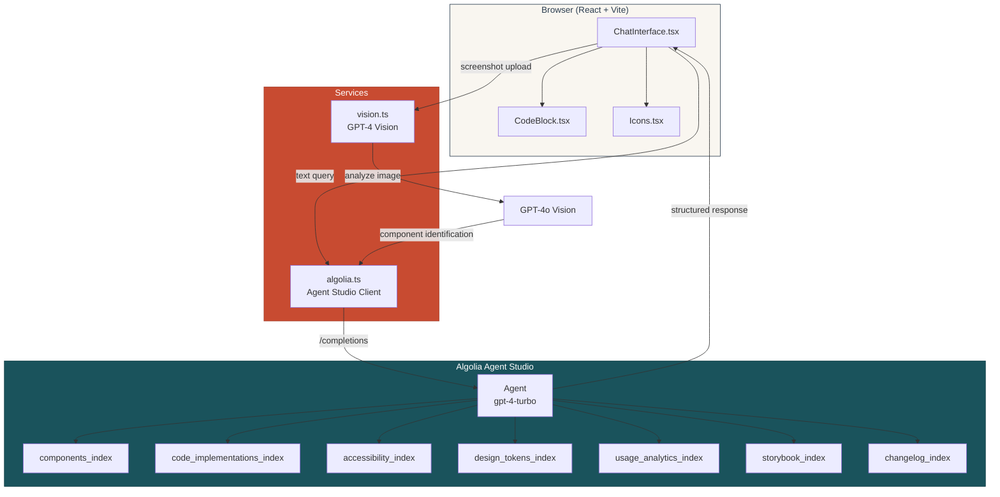

# ComponentCompass

**AI-Powered Design System Navigator** -- Algolia Agent Studio Challenge Submission

ComponentCompass helps developers find the right UI components through natural conversation. Built with Algolia Agent Studio, it orchestrates searches across 7 specialized indices to deliver comprehensive answers about components, code implementations, accessibility guidelines, design tokens, and more.

## Architecture



## Features

- **Multi-Index Search** -- Queries 7 Algolia indices simultaneously for comprehensive results
- **Screenshot Analysis** -- Upload design mockups; GPT-4 Vision identifies matching components
- **Syntax-Highlighted Code** -- Production-ready code examples with one-click copy
- **Session Persistence** -- Conversations saved to localStorage with export to Markdown
- **Cartographic Theme** -- Distinctive vintage map aesthetic with custom SVG icon system
- **Mobile-First Responsive** -- Full support for mobile viewports, safe areas, and touch targets

## Quick Start

```bash
# Install dependencies
npm install

# Configure environment
cp .env.example .env
# Fill in your Algolia and OpenAI keys

# Seed data to Algolia
node scripts/upload-enhanced.mjs

# Start dev server
npm run dev
```

Open **http://localhost:5173/**

## Environment Variables

```env
VITE_ALGOLIA_APP_ID=your_app_id
VITE_ALGOLIA_API_KEY=your_search_api_key
VITE_AGENT_ID=your_agent_id
VITE_OPENAI_API_KEY=your_openai_api_key   # optional, for screenshot analysis
```

## Project Structure

```
src/
  App.tsx                         Entry point
  components/
    ChatInterface.tsx             Main chat UI (~790 lines)
    CodeBlock.tsx                 Syntax-highlighted code display
    Icons.tsx                     Cartographic-themed SVG icons (20 icons)
  services/
    algolia.ts                    Algolia Agent Studio client
    vision.ts                     GPT-4 Vision screenshot analysis
data/                             Algolia index seed data (10 JSON files)
scripts/                          Data upload and test scripts
docs/                             Planning and specification documents
```

## Tech Stack

| Layer | Technology |
|-------|-----------|
| Framework | React 19, TypeScript 5.9, Vite 7 |
| Styling | Tailwind CSS 3.4 with custom design tokens |
| Fonts | Fraunces (display), Epilogue (body), JetBrains Mono (code) |
| AI Search | Algolia Agent Studio (gpt-4-turbo) |
| Vision | OpenAI GPT-4o |
| Rendering | react-markdown, prism-react-renderer |
| Icons | Custom SVG cartographic icon system |

## Contest Alignment

| Criteria | Weight | Approach |
|----------|--------|----------|
| Use of Technology | 40% | 7-index Agent Studio orchestration, real shadcn/ui data |
| UX | 25% | Cartographic theme, responsive design, visual loading states |
| Creativity | 20% | Map/compass metaphor, screenshot-to-component workflow |
| Innovation | 15% | Multimodal AI (text + vision), conversational design system |

## Keyboard Shortcuts

| Shortcut | Action |
|----------|--------|
| `Enter` | Send message |
| `Shift+Enter` | New line |
| `Cmd+K` | New conversation |
| `Cmd+E` | Export conversation |
| `Cmd+/` | Toggle session stats |

## Documentation

See the `docs/` directory for detailed planning documents:

- [Project Overview](docs/01-PROJECT-OVERVIEW.md)
- [Technical Architecture](docs/02-TECHNICAL-ARCHITECTURE.md)
- [Data Schemas](docs/03-DATA-SCHEMAS.md)
- [Agent Prompts](docs/04-AGENT-PROMPTS.md)
- [UI/UX Specs](docs/05-UI-UX-SPECS.md)
- [Implementation Roadmap](docs/06-IMPLEMENTATION-ROADMAP.md)
- [Demo Script](docs/07-DEMO-SCRIPT.md)

---

Built for the Algolia Agent Studio Challenge -- February 2026
